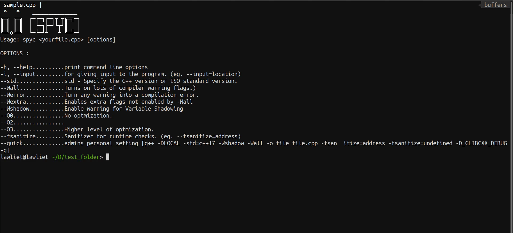
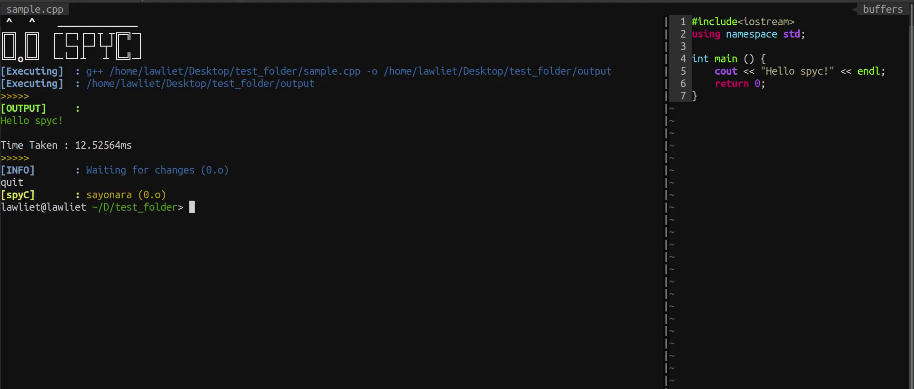
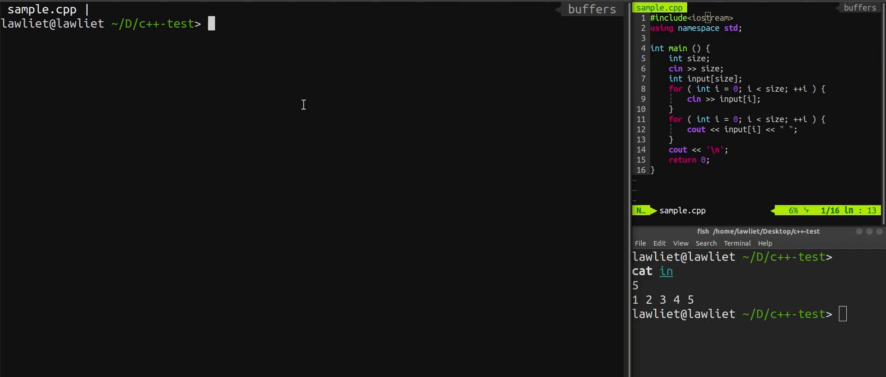
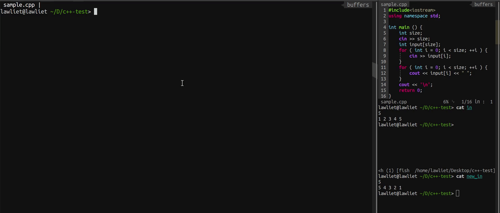
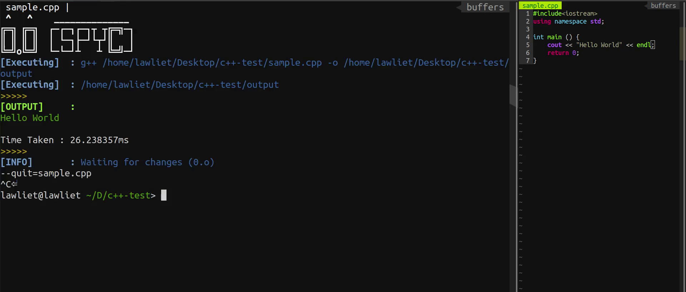
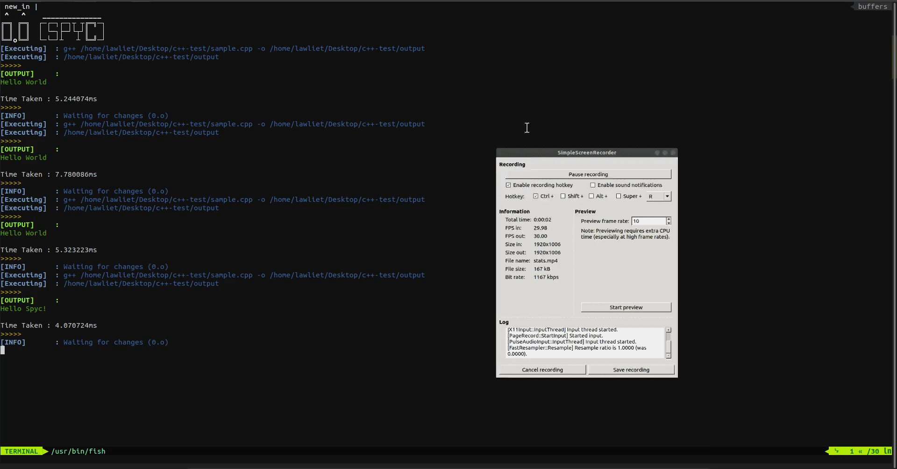

# So what is spyc ? 

<strong style="color:red"><em>`spyc`</em></strong>   is a `CLI` tool that monitors your `CPP` code and automatically compiles and executes the code whenever there is a change in the file.

<strong style="color:red"><em>`spyc`</em></strong> is designed mainly for competitive programmers so that they can efficiently debug and execute their code for multiple test cases without compiling again and again.

<strong style="color:red"><em>`spyc`</em></strong> also supports some of the common GCC flags used in competitive programming.


# Installation


### Using [npm](https://www.npmjs.com/~lawliet07) 

##### `Install` globally 

```bash
npm install -g spyc
```


##### `Install` as a dev dependency

```bash
npm install --save-dev spyc
```


# Usage

To run <strong style="color:red"><em>`spyc`</em></strong> write.

```bash
spyc <yourfile.cpp> [,options]
```


### Help


For CLI options,  use `-h` or `--help`.

```bash
spyc -h
```





## Runtime input

<strong style="color:red"><em>`spyc`</em></strong> allows user to provide or change the input file at runtime without stopping the currently running <strong style="color:red"><em>`spyc`</em></strong> program, this help programmers to check their code on multiple test cases without much effort.

For example click <a href='#r-input'>here</a>.


## Cat file

<strong style="color:red"><em>`spyc`</em></strong> also allows users to see their `cpp` file or input file at runtime with the help of `cat` option.

For example click <a href='#cat'>here</a>.


## Check Stats

In <strong style="color:red"><em>`spyc`</em></strong> user can also see the past stats using `stats` options for performance comparison. This helps the user to check and compare the efficiency of their code on different test cases.

For example click <a href='#stats'>here</a>.


## Supports some common gcc flags

<strong style="color:red"><em>`spyc`</em></strong> also support some of the common gcc flags like,


| Flags     |                                                         |
| --------- | ------------------------------------------------------- |
| std       | std - Specify the C++ version or ISO standard version.  |
| Wall      | Turns on lots of compiler warning flags.                |
| Werror    | Turn any warning into a compilation error.              |
| Wextra    | Enables extra flags not enabled by -Wall.               |
| Wshadow   | Enable warning for Variable Shadowing.                  |
| O0        | No optmization.                                         |
| O3        | Higher level of optmization.                            |
| fsanitize | Sanitizer for runtime checks. (eg. --fsanitize=address) |


## My personal flag options

You guys can also use my preferred GCC flag options for compiling the code using `quick`  flag.

```bash
spyc ./sample.cpp --quick
```

`quick` option will enable the following gcc flag combination.

``` bash
g++ -DLOCAL -std=c++17 -Wshadow -Wall -o <output> <yourfile.cpp> -fsanitize=address 
-fsanitize=undefined -D_GLIBCXX_DEBUG -g
```


## Examples

#### Demo to run simple cpp file.

**Run command.**

```bash
spyc ./sample.cpp
```




​		

#### Demo to run cpp file with input.

**Run command.**

```bash
spyc ./sample.cpp --input=<inputfile>
```

or

``` bash
spyc ./sample.cpp -i=<inputfile>
```





#### <span id='r-input'>Demo to change the input file without restarting the app. </span>

In <strong style="color:red"><em>`spyc`</em></strong>, we can also change or provide input at runtime without restarting the tool. 
This will help users to check their code on different test cases without wasting time on compiling and executing the code manually.

**Run command.**

```  bash
--input=./in
```

or

```bash
-i=./in
```





#### <span id='cat'>Demo to `cat` input or code at runtime.</span>

<strong style="color:red"><em>`spyc`</em></strong> can also display input file or cpp code at runtime without pausing or stopping the tool.

This helps competitive programmers to see and debug their code or check the input file within the <strong style="color:red"><em>`spyc`</em></strong> tool.

``` bash
--cat=<filename>
```




#### <span id='stats'>Demo to check the stats.</span>

In <strong style="color:red"><em>`spyc`</em></strong>, users can also see stats from past executions. This will help the user to optimize their code by comparing the execution time of their code.

```bash
stats
```



---

---
